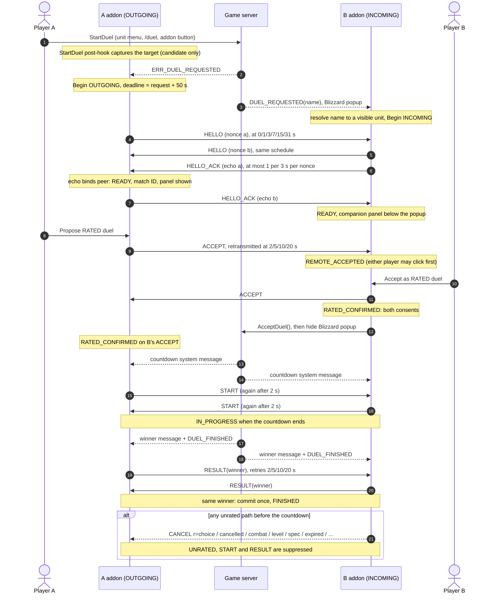
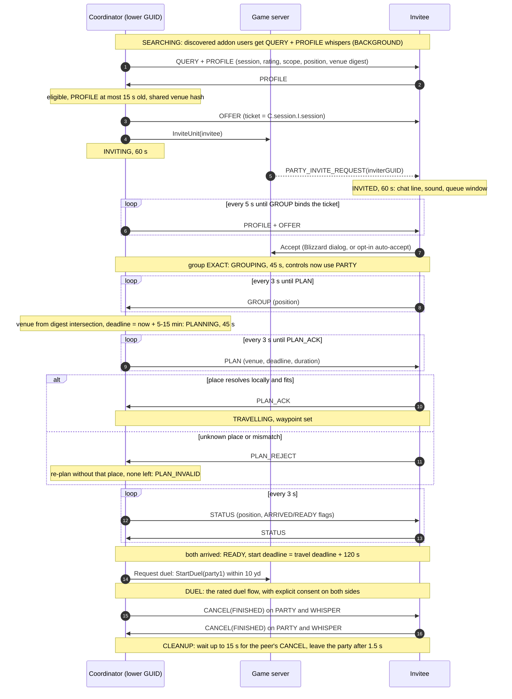

# ForeverDuelersGuild architecture (0.6.0)

This is a current-state reference for the code in `ForeverDuel/`. Every value below was read from the source; when the code changes, update this file in the same commit. Dated history up to 0.5.7 is in [docs/investigations/](docs/investigations/) and [CHANGELOG.md](CHANGELOG.md).

Every file receives the private namespace through `local _, FD = ...`. The only persistent global is the per-character SavedVariable `ForeverDuelDB`. There is no network service and no third-party library.

## Module map (TOC load order)

| # | File | Area | Responsibility |
| --- | --- | --- | --- |
| 1 | `Constants.lua` | foundation | `FD.C` versions, rating rules and duel timings; the command, status and event registries; `FD.Copy`. |
| 2 | `Locale.lua` | foundation | `FD.L[...]` / `FD.Locale:Format`: English source text is the key; a missing or broken translation falls back to English. See [Localization](#localization). |
| 3 | `Locale_deDE.lua` | foundation | Complete German translation registered for `deDE`, guarded by `tests/locale_spec.lua`. |
| 4 | `Native.lua` | foundation | `FD.Native`: shared checks for native values (readable, finite, plain text) used by the WoW-bound modules and windows. |
| 5 | `Debug.lua` | foundation | Chat output, persisted lifecycle/transport rings, persisted Lua errors, traffic counters. |
| 6 | `Commands.lua` | foundation | `/duelrating` dispatcher plus `help`, `debug`, `status`, `diagnose`, `errors`. |
| 7 | `Outbound.lua` | foundation | The only sender of addon messages: prefix registration, priority lanes, token budgets, retries, PARTY->WHISPER fallback, counters. |
| 8 | `Rating.lua` | data | Brackets, eligibility, level-weighted Elo, versioned `Rules()`. |
| 9 | `Database.lua` | data | Schema-2 `ForeverDuelDB`: load-time ledger validation, schema-1 Legacy migration, archive of another character's table, repair with quarantine, commit, reset. |
| 10 | `History.lua` | data | Read-only queries: recent, pages, series, details, overview statistics. |
| 11 | `Protocol.lua` | duel | FD3 envelope: 15 strict fields plus optional `key=value` extensions; FD2 recognition; nonces; match IDs. |
| 12 | `Results.lua` | duel | Pure parser for the localized countdown and winner system messages. |
| 13 | `Duel.lua` | duel | Rated state machine: consent, freshness checks, evidence, finalization, CANCEL reasons. No game globals; the environment is injected. |
| 14 | `Comms.lua` | duel | Duel packets to Outbound (drain validity, PARTY/WHISPER route), receive gates, own-PARTY-echo filter, status lines. |
| 15 | `Widgets.lua` | UI | `FD.Widgets`: shared frame helpers for the windows (panels, labels, buttons, dropdowns, fit, toggle, isolated `Run`). |
| 16 | `UI.lua` | duel | The rated panel (companion below Blizzard's popup or standalone), chat summary and history. |
| 17 | `Profile.lua` | UI | Movable overview: mode selectors, chart, paged history, details, archive/quarantine notice. |
| 18 | `Minimap.lua` | UI | Minimap button with saved angle and a localized tooltip. |
| 19 | `Presence.lua` | discovery | On-demand profile whispers, CHANNEL posts, profile cache, quiet mode, `ping`. |
| 20 | `Roster.lua` | discovery | Membership of the `ForeverDuel` chat channel: join, member list, failure detection, selection restore. |
| 21 | `Zone.lua` | UI | Players in zone browser: filters, Refresh, "last seen", Duel button. |
| 22 | `Tooltip.lua` | UI | Rating line on player tooltips, only for corroborated profiles. |
| 23 | `Wow.lua` | duel | Native adapter: identity, outgoing capture and acknowledgment, incoming resolution, system messages, hooks, `RequestDuel`, duel events. |
| 24 | `QueueProtocol.lua` | queue | Queue protocol 2 (`ForeverDuelQ2`, wire `FQ2`): schemas, reasons, validation. |
| 25 | `Venues.lua` | queue | Pure venue logic: eligibility, digest hashes, selection, travel estimate, same-spot test. |
| 26 | `Queue.lua` | queue | Queue engine: forward transitions, one deadline per state, `Finish` with outcome classes. Environment is injected. |
| 27 | `QueueWow.lua` | queue | Native queue adapter: ruleset, position, GUID group classification, invitations, co-location, tested places, waypoint. |
| 28 | `QueueTransport.lua` | queue | Queue packets to Outbound; sender, PARTY and ticket checks on receive. |
| 29 | `QueueUI.lua` | UI | Queue window. While shown it refreshes at 1 Hz whenever the queue is not `IDLE`; when idle, only while a cooldown, a notice, the ruleset detection, a cleanup advisory, the **Leave group** button or the profile count can change without a queue render. |
| 30 | `QueueCore.lua` | queue | Queue wiring: events, 1 s pulse, tested-place sharing, `queue` command and status. |
| 31 | `Core.lua` | foundation | Bootstrap, `FD:Safe` recovery, `ui`/`summary`/`history`/`reset`/`repair`, event frame. Loads last. |

## Load order and bootstrap

- The TOC order above is the load order. Modules register commands, status sections and events at file scope; `Core.lua` loads last and registers every collected event on one frame.
- `PLAYER_LOGIN` and `PLAYER_ENTERING_WORLD` call `FD:Initialize`. It waits for a readable native identity (15 retries, 2 s apart), loads `ForeverDuelDB`, then runs isolated steps: dialog, transport, duel, hooks, minimap, discovery, tooltip, queue. A failing step is saved as an error and the others still start.
- If saved data cannot be loaded, rating stays disabled and the data stays untouched. `/duelrating repair` keeps it under `quarantine` and starts fresh. A table that belongs to another character GUID with the same name (for example a re-rolled Hardcore character) is moved to `archived[oldGUID]`, at most three archives.
- `FD:Safe` runs every handler with `xpcall`, saves the error with its stack and calls `FD:RecoverDuel`. That runs `Duel:Abort`, which sends CANCEL and notifies the queue. Blizzard's popup is left alone.
- Discovery, queue and window code use their own `Run` wrappers. Their errors are saved but never reach `FD:Safe`, so they cannot stop a rated duel.

## Registries (Constants.lua)

- **Commands:** `FD:RegisterCommand(name, run, help, order, anyState)`. `FD:Command` finds the subcommand in the lowercased input and calls `run(rest, rawRest)`: `rest` is the lowercased argument text, `rawRest` the same text in its original case (character names, venue IDs). An empty command means `ui`; an unknown one prints the list. Without loadable saved data only `anyState` commands run: `help`, `status`, `diagnose`, `errors`, `repair`.

  | Owner | Commands |
  | --- | --- |
  | Commands.lua | `help`, `debug`, `status`, `diagnose [lifecycle\|transport]`, `errors [clear]` |
  | Core.lua | `ui`, `summary`, `history`, `reset [confirm]`, `repair [confirm]` |
  | Zone.lua | `zone` |
  | Presence.lua | `quiet`, `ping [name]` |
  | QueueCore.lua | `queue [join\|leave\|status\|autoaccept on\|off\|help\|venue add\|import\|remove]` |

- **Status sections:** `FD:RegisterStatus(order, lines)`. `/duelrating status` prints them sorted: 10 Core (version and build, transport, state, debug, last error, traffic), 12 Database (archives, quarantine), 20 Wow (requests, native self and opponent, peer confirmation and version, discovery round trip), 25 Comms (queued packets, last send and receive, peer validation), 30 Presence (discovery status, route, quiet, roster), 40 QueueCore (queue state, last cancellation, criteria, opponent, place, queue send and receive). A failing section prints `status section failed` instead of breaking the command. Sections 10, 20 and 25 are English diagnostics; 12, 30 and 40 use localized labels around internal codes (states, reasons, routes).
- **Events:** `FD:OnEvent(event, run, always, optional)`. Core registers each event once (optional events through `pcall`, recorded in `FD.eventRegistered`) and calls the handlers in load order through `FD:Safe`. Handlers without `always` run only after initialization. Presence registers its handlers with `always` and wraps them in `Presence:Run`.

## Outbound: budgets and priorities

All three prefixes go through `FD.Outbound`: `ForeverDuel2` (rated duel), `ForeverDuelZone2` (discovery and ping) and `ForeverDuelQ2` (queue). No other module calls `SendAddonMessage`, and the addon never sends ordinary chat.

- **Lanes**, served strictly in this order: CONTROL (all rated-duel packets), QUEUE (queue ticket controls, tested-place packets, ping/pong), BACKGROUND (discovery queries, replies and CHANNEL posts; queue QUERY/PROFILE/LEAVE). BACKGROUND needs a spare token reserve, so it can never use up the budget that the other lanes need.
- **Budgets:** one WHISPER bucket shared by every prefix, plus one bucket per prefix and group/CHANNEL route. Any two submissions are at least 0.1 s apart.
- **Per item:** a `key` replaces a queued item with the same key, `isCurrent()` is checked at drain (obsolete packets are dropped), `route()` picks PARTY or WHISPER at drain time, and `ttl` bounds the wait. `onResult` reports `sent`, `failed`, `expired` or `dropped`.
- **Results:** throttle results are retried with backoff until the TTL. `false`, `GeneralError` and `AddOnMessageLockdown` get up to three attempts. `InvalidChatType` or `NotInGroup` on a non-WHISPER route falls back to one WHISPER copy, unless the item forbids it (CHANNEL posts, ping). `InvalidChatType` also disables that route for the session.
- `SendNow` submits at once without pacing or token checks. It carries the rated CANCEL on logout or `/reload`, and on a loading screen while a request or an unfinished duel is pending, and every terminal queue CANCEL (sent before the queue party is left). A loading screen after `DUEL_FINISHED` (or in `FINISHING`) keeps the match: the Lua state survives it, so the RESULT exchange, its retries and `RESULT_TIMEOUT` continue afterwards.
- A rated packet marked mandatory (the first ACCEPT, the first RESULT) unrates the match when it fails or expires (`r=transport`). Redundant copies never do.

## Rated duel (protocol 3)

Wire format: `FD3|kind|nonce|echo|guid|peerGUID|role|rating|specId|classFile|wins|losses|verdict|level|maxLevel[|key=value...]`. The kinds are `HELLO`, `HELLO_ACK`, `ACCEPT`, `START`, `RESULT` and `CANCEL`. The known extensions are `v` (sender version, on HELLO and HELLO_ACK) and `r` (CANCEL reason). The fixed fields are strict. A malformed, unknown or duplicate extension is ignored, never the packet. An FD2 envelope from the current request's opponent (same sender and GUID) marks them as outdated, and nothing else is done with it. The match ID is `FD3:<lower GUID>:<its nonce>:<higher GUID>:<its nonce>`.

States: `CHECKING_ADDON` → `READY` (the peer echoed this request's nonce) → `LOCAL_ACCEPTED` or `REMOTE_ACCEPTED` → `RATED_CONFIRMED` (both consents) → `COUNTDOWN` → `IN_PROGRESS` → `FINISHING` → `FINISHED`. Any state before `FINISHED` can go to `UNRATED`, then `UNRATED_ACTIVE` once the duel runs. The challenger (OUTGOING) may also go from `LOCAL_ACCEPTED` to `COUNTDOWN`: see the tentative countdown below.

Details the diagram leaves out:

- **Binding:** a bare HELLO is answered but never binds, because it may belong to an older request. HELLOs whose nonce time is more than 10 s older than this request are rejected. The first HELLO_ACK that echoes the own nonce binds the peer's nonce and profile and fixes the match ID. The round trip from the first sent HELLO is shown in status.
- **Panel:** it appears only after binding. The receiver's companion has only the rated button; its X keeps the duel unrated. Esc there reaches Blizzard's popup first, which declines the request. The challenger's panel has Propose/Accept RATED, Keep unrated, the X and Esc. Esc reaches the panel only through `UISpecialFrames`: Blizzard's `CloseAllWindows` hides it in the same Esc that closes open bags and windows, and also on loss of control, death or a loading screen; every such close keeps the duel unrated. The addon never calls `RegisterGameMenuEscHandler`, because an entry written by addon code would taint Blizzard's Esc handler list (`ClearTarget`, `SpellStopCasting`, the game menu). Both show a 1 Hz expiry countdown. A player who is already in combat when the request begins sees the rated button disabled ("Leave combat to choose a rated duel."); it works again once combat ends within the window (`PLAYER_REGEN_ENABLED` re-renders the panel). Entering combat while a request is pending, before the countdown, unrates it for good (`PLAYER_REGEN_DISABLED`, `CANCEL r=combat`).
- **Native accept:** only the receiver calls `AcceptDuel`, and only from `RATED_CONFIRMED`. Every other accept (Blizzard's button or another addon), seen through the `AcceptDuel` hook, makes the duel unrated and sends `CANCEL r=choice`. If no countdown follows within 8 s of any accept, the match is released, with `CANCEL r=timeout` if it was still rated. After the addon's own accept, the receiver is told to ask for a new challenge.
- **Tentative countdown:** the challenger's countdown can arrive before the receiver's ACCEPT. A countdown in `LOCAL_ACCEPTED` is therefore tentatively rated, and the chat says "Waiting for X to confirm the RATED duel". The RATED line appears only after the peer's ACCEPT, START or RESULT arrives. Every unrated path on the receiver sends CANCEL and suppresses START and RESULT, so a tentative countdown can never finalize without both consents.
- **Expiry:** the 50 s request window is the only decision timer. A challenger that has already consented gets one extra 8 s grace, because the receiver's window starts later. No CANCEL is sent for timing reasons after a countdown.
- **Results:** a bound RESULT also counts as the peer's START. Finalization needs: the local countdown, start and finish; a local winner message; the peer's START or RESULT; the same winner on both sides; unchanged own identity, level, spec and rating; and a successful `Database:Commit`. Otherwise the match times out after 30 s in `FINISHING` without a record. The last five finished matches answer late START or RESULT packets for 5 minutes, at most four times each.
- **Rematch:** a new request while the previous match is still `FINISHING` parks that match in one slot. The new request waits until the parked result settles, so it announces the updated rating. The server sends a duel's winner line before any newer request, so a parked match is sealed: winner lines go only to the active match, and a parked match takes only the peer's START, RESULT or CANCEL (a CANCEL drops it and releases the waiting request at once). A `FINISHING` match without its own winner line can never finalize; a new request drops it at once ("Match not rated: ...") instead of holding the new request for `RESULT_TIMEOUT`. An untracked request acknowledgment (`ERR_DUEL_REQUESTED`), a duel to the death and a later countdown seal a finished active match the same way.
- **Outgoing capture:** the `StartDuel` post-hook resolves the target or the typed name among visible units. A repeat to the same GUID replaces the capture. A different target is untracked until the first attempt's window ends; that window is never extended. A duel-related failure notice within 2 s (for example out of range) clears the capture so the player can retry. Duels to the death are never tracked. If tracking cannot attach to a request that went out, one chat line says why.
- **Routes:** a packet goes over PARTY only when, at drain time, the group is exactly the player and the bound opponent (GUIDs and full name, no raid). Otherwise it is whispered. In such a group the first HELLO is also whispered once. PARTY packets from the bound opponent are accepted even when the own roster view is not exact yet, and own PARTY echoes are ignored.

## Queue (protocol 2)

States: `IDLE` → `SEARCHING` (↔ `PAUSED` for combat, unreadable position or an unrelated duel) → `INVITING` (coordinator) or `INVITED` (invitee) → `GROUPING` → `PLANNING` (coordinator) → `TRAVELLING` → `READY` → `DUEL`. `Finish(reason)` is the only way out: it sends the terminal CANCEL, applies the outcome class and enters `CLEANUP`, then `IDLE` or a new search. Queue packets never create rated consent, native identity or result evidence.

Group state comes from one pure classifier (`Queue.ClassifyGroup`) over native readings. Only a raid, a third member or a readable `party1` GUID that differs from the opponent's is `CHANGED`. Missing or loading data is `PENDING`. Names are never compared.

- **Pairing:** the coordinator chooses the best eligible candidate it may coordinate (lower own GUID): smallest rating difference, then the earlier join, then GUID. A better candidate with a lower GUID invites us instead. Blizzard's invitation dialog is the pairing consent. An invitee that is already in a match answers `CANCEL(BUSY)`. A pair that is still blocked answers `DECLINED` and declines the open dialog. `ERR_DECLINE_GROUP_S` tells the coordinator about a decline. A declined, rescinded or expired invitation is never announced or auto-accepted late.
- **Re-keying:** until a plan exists, the ticket follows the peer's newest session (`Rekey`). An OFFER that names our old session is answered with our current PROFILE (`Reintroduce`).
- **Arrival:** own arrival latches after three consecutive samples within 40 yd before the deadline. The peer's arrival comes from its STATUS flag, or from native party distance once we have arrived. `READY` is symmetric. Only the coordinator's **Request duel** works, and it checks co-location first (same phase and instance, within 10 yd horizontally and 5 yd vertically). A failed check shows the reason and never cancels.
- **Duel hand-off:** a native duel request against the ticket peer moves the queue to `DUEL`. A request withdrawn before its countdown returns to the previous state while its deadline holds. A peer's CANCEL during `DUEL` or `CLEANUP` is recorded but does not end the local result exchange.
- **Leaving:** a terminal CANCEL is submitted synchronously on PARTY and WHISPER, and a failed whisper copy is re-queued at CONTROL priority. `PLAYER_LOGOUT` (also fired by `/reload`) sends `CANCEL(RELOAD)`. A loading screen does not cancel; it starts a 15 s grace. Only the exact queue-owned two-player group is ever left automatically. Otherwise cleanup ends with an advisory, and if the leftover group is exactly the queue pair, a **Leave group** button leaves it.
- **Tested places:** `Save tested place` needs a duel that ended by knockout in friendly outdoor territory less than 5 minutes ago, saved within 40 yd of the spot while solo and out of combat. The record goes to the test partner as `VENUE`. The partner accepts it only against its own matching test and answers `VENUE_ACK` (with the ID it kept) or `VENUE_REJECT` (`NO_TEST`, `MISMATCH`, `METADATA`, `TERRITORY`, `BUSY`, `HUB`, `FULL`, `INVALID`). Records of one spot within 40 yd merge to the lexically smaller ID on both clients.

| CANCEL reason | Typical trigger | Outcome class and effect |
| --- | --- | --- |
| `CANCELLED` | a player left the queue | decision: the leaver goes idle, the other requeues; the pair is blocked for 2 min on both sides |
| `DECLINED` | invitation declined, or the pair is still blocked | decision: requeue, pair blocked 2 min |
| `GROUP_TIMEOUT` | invitation not accepted within 60 s | decision: coordinator requeues and blocks the pair. An invitee that saw the dialog and did not join blocks and leaves the queue. Unseen or rescinded: requeue and retry. |
| `TRAVEL_TIMEOUT` | travel deadline passed | no-show, judged from the own position: arrived requeues and keeps the wait; absent gets a 2 min queue pause; unknown goes idle |
| `START_TIMEOUT`, `DUEL`, `FINISHED` | no duel before the start deadline / duel ended without rating / match completed | ended: idle |
| `BUSY`, `INVITE_FAILED`, `PEER_SILENT`, `GROUP_CHANGED`, `OPPONENT_LEFT`, `NO_VENUE`, `PLAN_INVALID`, `ERROR`, `RELOAD` | technical or circumstantial | transient: requeue with the waiting time kept; the same opponent again after 15 s; three failures with one opponent block the pair for 2 min; an `ERROR` repeated within 60 s goes idle |

Each reason has a local sentence and a form for the other side ("Your opponent's client cancelled because ..."). The player's own leave prints no extra line.

## Discovery (Presence and Roster)

Profiles (`FDP2|guid|rating|mapID|classFile|level|maxLevel`, queries `FDQ2|...`) are advisory self-reports, keyed by the sender name the server reports. They never supply consent, snapshots or results.

- **Queries** go out only on demand: to the target or mouseover (same faction, readable) while the zone window is open or for 10 s after **Refresh**, or when their tooltip shows; to channel members while the zone window is open, the queue is `SEARCHING` or `PAUSED`, or for 10 s after **Refresh**. Targeting alone (zone window closed, no tooltip) sends nothing: `PLAYER_TARGET_CHANGED` only wakes discovery while the zone window is shown. Nothing is queried while a duel request or a queue ticket exists. There is no nameplate, party or raid fan-out. A query (`FDQ2`) carries the full own profile, real map ID included, to the queried player.
- **Replies** (`FDP2` whispers) go only to trusted senders: queue peers, channel members and visible units with that name. A query from an unknown sender waits up to 20 s for a roster read to prove membership and is otherwise never answered. `Presence:MapFor` sets the map in replies: the real map ID for visible units and queue peers, and for channel members whose last profile reported the same map; other channel members get map 0, which keeps us out of their zone browser. Without a working CHANNEL route, profile changes are pushed the same way to fresh trusted peers, at most every 30 s.
- **CHANNEL:** `Presence:Broadcast` posts the full own profile, real map ID included, to every member of the `ForeverDuel` channel; `MapFor` does not apply. After joining, one post per session is an experiment. Only another player's CHANNEL profile proves that channel delivery works. While that holds and our own post was accepted, a heartbeat post every 60 s and an update post after profile changes (at most every 30 s) replace member queries. While others' posts arrive but ours are rejected, a retry post goes out every 10 minutes. A newcomer's first post is answered with one whispered reply (at most one greeting per 10 s).
- **Roster:** the `ForeverDuel` channel is joined (temporary) only after the default channels exist. Password, ban, missing-after-join and manual-leave failures are detected. A fully readable roster read replaces the member list. Loading the list may briefly change the native channel selection; it is restored, and it is never touched while the Channels window is open.
- **Quiet mode** (`settings.quiet`) stops every Presence and Roster send and drops pending work. Only `ping` and its PONG stay, because they are the measurement.
- **Ping:** `PING|seq|ms` is answered with `PONG|seq|ms`, at most once per 2 s per sender and route, and only to cached players, channel members, the target or party members. The round trip is measured on the pinging client.

## Localization

- User-facing text is written in English and used as the lookup key: `FD.L["..."]` for fixed text, `FD.Locale:Format(pattern, ...)` for patterns. Lua 5.1 has no positional arguments, so a translation keeps the placeholders in the same order. A missing translation, or one whose placeholders do not fit the arguments, falls back to English, so a label is never empty and never shows a raw `%s`.
- `Locale_deDE.lua` translates every user-facing text (informal "du"; glossary at the top of the file). Status texts for steps the addon performs itself use descriptive forms ("Gegner wird eingeladen", "Warten auf ..."); imperatives are kept for what the player must do. Slash commands, the addon and channel names and saved-data keys stay unchanged.
- `tests/locale_spec.lua` reads every TOC module and fails when a user-facing key has no German entry, when a German entry is unused, or when placeholders, slash commands, escape pipes or line breaks differ from the English key. It finds literal `FD.L[...]`, `L(...)` and `Format(...)` arguments, the named text tables (for example `STATE_NAMES`, `CANCEL_TEXT`) and a short list of literals passed through variables (such as the Outbound delivery states `sent`, `failed`, `expired`, `dropped`). Every new user-facing string therefore needs a deDE entry in the same commit.
- Diagnostic output stays English on purpose, so bug reports read the same on every client: the status sections of Core, Wow and Comms (version, state, traffic, request, native, peer, send and receive lines), the `diagnose` and `errors` entries, and debug chat output. The zone and queue status lines have German labels, but internal codes in them (states, CANCEL reasons, routes) stay English.

## Diagnostics (Debug.lua)

- **Rings:** `settings.requestDiagnostics` (lifecycle) and `settings.transportDiagnostics` (transport) keep 64 entries each, so transport noise cannot push out lifecycle evidence. Each entry has the version and build, server and client time, topic and a detail of at most 320 characters. Identical repeats within 5–10 s are compacted into a repeat count, never across an episode boundary (`duel detected`, `state`, `queue state`, `outgoing request`, `incoming native name`, `session`).
- **Topics:** lifecycle holds request capture and resolution, duel states, peer validation, unrated reasons, received CANCELs, `session` (login, reload or world transition), errors, queue state/group/planning/cancel/invite/venue, prefix registration, version mismatch, and `UI_INFO_MESSAGE`/`UI_ERROR_MESSAGE` for `ERR_DUEL*` IDs only. Transport holds duel and queue sends and receipts, rejected packets, `outbound` failures and expiries, `ping`, and only rare discovery facts: the CHANNEL experiment, changed CHANNEL outcomes, the route becoming audible, and the first whisper failure of each kind. Routine discovery whispers are chat-debug only (`zone traffic`).
- **Errors:** `settings.errorDiagnostics` keeps 10 Lua errors with context, message (400 characters), stack (900), version and time. Repeats are counted. They are always saved and announced in chat once per session.
- **Traffic counters:** per prefix and channel, counts of submitted, success, throttled, failed, dropped and expired, plus a rolling minute with unique recipients. `settings.trafficCounters` keeps the totals and the last complete minute, with only the number of recipients.
- **Privacy bounds:** diagnostics never contain packet payloads, nonces, queue sessions or tickets, or positions, and the counters keep no recipient names. Some topics keep only their first arguments for this reason. Diagnostic entries do contain character names and GUIDs of opponents and recipients. Never saved at all: the discovery cache, channel members, and the active duel and queue state (only queue preferences, tested places, pair blocks and the cooldown persist). `FD.C.BUILD` comes from the `X-Build` TOC line written by `tools/install-addon.ps1`.

## Saved data

`ForeverDuelDB` (schema 2) holds `player.ratings.LEVELING` and `MAX_LEVEL`, `player.initialRatings`, `matches` (oldest first), `finalized[matchId]`, `settings`, `nonceCounter`, and optionally `legacy`, `archived` and `quarantine`. Each record stores the rating rules it was calculated with. Loading checks each pool as a ledger: structure, the chain from the initial rating, before plus delta equals after, the sign matches WIN or LOSS, totals, the finalized index, duplicate IDs and bracket against the stored levels. It never recomputes old records with today's constants; only records with rules version 1 are recomputed, with their own stored rules. `Commit` rejects a stale `ratingBefore` and duplicate match IDs, and writes in one sequence without callbacks. Reset clears ratings, history and Legacy and keeps settings, archives and quarantine. Queue preferences, tested places, pair blocks and the no-show cooldown live in `settings.queue`.

## Safety invariants

1. A rated record requires both explicit rated clicks, each bound to both request nonces, before the native countdown. A peer packet alone never creates consent.
2. Native identity (GUID, class, level, cap) comes from local unit APIs at the start of the request. Peer packets must match it and can never replace it.
3. The addon never hides or changes Blizzard's duel popup before its own `AcceptDuel`, and never edits `StaticPopupDialogs`. Every other native accept makes the duel unrated.
4. Unrating a match sends CANCEL with a reason to a bound peer (an outdated FD2 peer cannot read it and gets none), and START and RESULT are suppressed from then on. No timing CANCEL is sent after a countdown.
5. Finalization needs the local countdown, start, finish and winner, the peer's START or RESULT, and agreement. Each match ID commits at most once.
6. Discovery profiles, queue packets and diagnostics never supply consent, snapshots or results.
7. Errors in discovery, the queue or the windows never enter `FD:Safe`. A rated-flow error ends the flow with a CANCEL and leaves Blizzard's popup usable.
8. PARTY is used only for the exact two-player group with the bound opponent. Automatic cleanup leaves only the exact queue-owned group.
9. Saved data is never reset silently: damaged data is quarantined on request, another character's data is archived, and rule changes never invalidate stored history.

## Timing and budget reference

Read from the source. `Comms.lua` has no timing constants of its own: duel packets use the `FD.C` values and Outbound.

| Source | Constant | Value | Meaning |
| --- | --- | --- | --- |
| Constants.lua | `PENDING_TIMEOUT` | 50 s | Native request window; the only decision timer. |
| Constants.lua | `OUTGOING_TIMEOUT` | 50 s (= `PENDING_TIMEOUT`) | Capture window for a StartDuel attempt; untracked-attempt block. |
| Constants.lua | `INCOMING_RETRY_INTERVAL` | 0.5 s | Retry resolving the challenger while the popup is visible. |
| Constants.lua | `HELLO_SCHEDULE` | 0, 1, 3, 7, 15, 31 s | HELLO sends after Begin (same nonce, keyed). |
| Constants.lua | `ACCEPT_SCHEDULE` | 0, 2, 5, 10, 20 s | ACCEPT sends after the own rated click. |
| Constants.lua | `ACK_INTERVAL` | 3 s | At most one HELLO_ACK per peer nonce. |
| Constants.lua | `DELAY_NOTICE` | 8 s | "Addon messages to X are delayed" line (known addon users only). |
| Constants.lua | `STALE_HELLO` | 10 s | Reject HELLOs from requests older than this request. |
| Constants.lua | `START_TIMEOUT` | 8 s | Release after an accept without countdown; challenger grace after expiry. |
| Constants.lua | `START_REPEAT` | 2 s | Second START after the countdown. |
| Constants.lua | `RESULT_TIMEOUT` | 30 s | `FINISHING` window; TTL of the mandatory RESULT. |
| Constants.lua | `RESULT_SCHEDULE` | 2, 5, 10, 20 s | RESULT retries while finishing; also the answer limit (4). |
| Constants.lua | `RECENT_MATCHES`, `RECENT_TTL` | 5, 300 s | Finished matches answering late START/RESULT, at least 1 s apart. |
| Constants.lua | `MATCH_TIMEOUT` | 1200 s | Drop a match whose `DUEL_FINISHED` was missed. |
| Constants.lua | `FAILURE_WINDOW` | 2 s | Failure notice after StartDuel clears the capture. |
| Constants.lua | `K_FACTOR`, `LEVEL_RATING_WEIGHT`, `MAX_LEVEL_DIFFERENCE`, `INITIAL_RATING` | 32, 20, 5, 1500 | Rating rules (stored per record). |
| Duel.lua | first ACCEPT TTL | remaining request window (at least 1 s) | Mandatory: a failure unrates with `r=transport`. |
| Duel.lua | first RESULT TTL | `RESULT_TIMEOUT` | Mandatory; retries are redundant. |
| Duel.lua | other duel packets | Outbound default 10 s | Redundant copies. |
| Queue.lua | `T.PROFILE_FRESHNESS`, `T.PROFILE_RETENTION` | 15 s, 120 s | PROFILE age to start a match; forget a queue peer. |
| Queue.lua | `T.QUERY_SPACING` | 2 s | At most one QUERY+PROFILE per 2 s. |
| Queue.lua | `T.ACTIVE_QUERY_INTERVAL`, `T.DISCOVERY_QUERY_INTERVAL` | 5 s, 30 s | Per-candidate query interval: queue peers / other addon users. |
| Queue.lua | `T.INVITE_RECOGNITION` | 60 s | Remembered invitation, OFFER or PROFILE age for binding. |
| Queue.lua | `T.INVITE` | 60 s | `INVITING`/`INVITED` deadline: `GROUP_TIMEOUT`. |
| Queue.lua | `T.GROUPING`, `T.PLANNING` | 45 s, 45 s | State deadlines: `PEER_SILENT`. |
| Queue.lua | `T.OFFER_RETRY` | 5 s | Coordinator repeats PROFILE+OFFER until GROUP. |
| Queue.lua | `T.RETRY` | 3 s | GROUP and PLAN repeat; Reintroduce spacing. |
| Queue.lua | `T.STATUS` | 3 s | STATUS while travelling or ready. |
| Queue.lua | `T.SILENT` | 30 s | No packet and no native presence while travelling: `PEER_SILENT`. |
| Queue.lua | `T.SOLO_GRACE` | 5 s | Group dissolved: `OPPONENT_LEFT`. |
| Queue.lua | `T.LOAD_GRACE` | 15 s | No arrival or silence verdict after a loading screen. |
| Queue.lua | `T.CLOCK_SKEW` | 5 s | Allowed PLAN deadline skew. |
| Queue.lua | `T.START_WINDOW` | 120 s | Start deadline after the travel deadline: `START_TIMEOUT`. |
| Queue.lua | `DUEL` limit | `MATCH_TIMEOUT` + 60 = 1260 s | `DUEL` state deadline. |
| Queue.lua | `T.RESULT_WAIT` | 15 s | Keep the group for the peer's result after `FINISHED`. |
| Queue.lua | `T.CLEANUP`, `T.LEAVE_DELAY` | 20 s, 1.5 s | Cleanup bound; leave the party after the CANCEL. |
| Queue.lua | `T.BLOCK`, `T.COOLDOWN`, `T.RETRY_DELAY` | 120 s, 120 s, 15 s | Pair block; no-show pause; retry the same opponent. |
| Queue.lua | `T.RADIUS`, `T.LEAVE_LIMIT` | 40 yd, 10 | Arrival radius (3 samples); LEAVE recipients. |
| Queue.lua | rating window | ±100, ±200 after 120 s, ±400 after 300 s | The stricter of both players applies. |
| QueueCore.lua | pulse | 1 s | Queue tick. |
| QueueTransport.lua | TTL | QUERY 8, PROFILE 8, LEAVE 10, CANCEL 30, VENUE* 20, other 10 s | Queue packet lifetimes. |
| QueueWow.lua | co-location; tested place | 10 yd / 5 yd vertical; 5 min and 40 yd, 100 places | Request duel check; save window and catalog size. |
| Venues.lua | travel time | max(300, 1.5 × walk + 120) s at 7 yd/s (11.2 from level 40), at most 900 s; cross-continent 900 s | Plan duration; digest at most 8 places. |
| Presence.lua | `TICK`, `PULSE` | 2 s, 5 s | Minimum tick spacing; housekeeping cadence. |
| Presence.lua | `EXPIRY`, `STALE`, `FORGET`, `MAX_PLAYERS` | 180 s, 45 s, 600 s, 300 | Profile validity; "last seen" marker; forget; cache size. |
| Presence.lua | `HEARTBEAT`, `STRANGER` | 45 s, 600 s | Query interval for known users and members / for names that never answered. |
| Presence.lua | `ASK_GAP`, `MANUAL` | 3 s, 10 s | Tooltip query spacing; Refresh window. |
| Presence.lua | `MIN_REPLY`, `HOLD`, `GREET_GAP` | 5 s, 20 s, 10 s | Replies per sender; wait for membership proof; CHANNEL newcomer greeting. |
| Presence.lua | `WORK_LIMIT`, `WORK_TTL`, `QUERY_BACKLOG` | 30, 30 s, 6 | Pending whispers (one in flight); their lifetime; member queries waiting. |
| Presence.lua | `ANNOUNCE_GAP`, `BROADCAST`, `CHANNEL_STALE`, `CHANNEL_RETRY` | 30 s, 60 s, 180 s, 600 s | Profile push; CHANNEL heartbeat; CHANNEL mode ends; retry a rejected route. CHANNEL post TTL 20 s. |
| Presence.lua | `NOT_FOUND_WINDOW` | 5 s | Hide "No player named ..." for own recent whispers. |
| Presence.lua | `PING_TIMEOUT`, `PONG_GAP`, `MAX_PINGS` | 90 s, 2 s, 20 | Ping wait; PONG rate per sender and route; open pings. Ping TTL 10 s. |
| Roster.lua | `REFRESH`, `MANUAL`, `WAIT`, `RECENT`, `LIMIT` | 60 s, 10 s, 5 s, 15 s, 300 | Roster requests; selection hold; keep event-proven joins; member cap. |
| Roster.lua | `JOIN_CHECK`, `JOIN_RETRY`, `JOIN_FALLBACK`, `UI_SETTLE` | 5 s, 60 s, 15 s, 3 s | Channel join checks and gating. |
| Outbound.lua | `SPACING` | 0.1 s | Between any two submissions. |
| Outbound.lua | `LANE_LIMIT` | 48 / 48 / 30 | CONTROL / QUEUE / BACKGROUND queue length; a full lane drops new items. |
| Outbound.lua | `DEFAULT_TTL` | 10 s | Item lifetime unless set. |
| Outbound.lua | `BUCKETS.WHISPER` | 8 burst, +1/s | Shared by all prefixes. |
| Outbound.lua | `BUCKETS.group` | 10 burst, +1/s | Per prefix and PARTY/CHANNEL route. |
| Outbound.lua | `BACKGROUND_RESERVE` | 3 | BACKGROUND needs 4 tokens. |
| Outbound.lua | retries | throttle: 2, 4, 8, 8 ... s until TTL; transient: 3 attempts | Result handling. |
| Debug.lua | `RING_LIMIT`, `ERROR_LIMIT` | 64 per ring, 10 | Persisted diagnostics. |
| Core.lua | initialization; reset | 15 retries × 2 s; 15 s | Identity wait; reset confirmation. |
