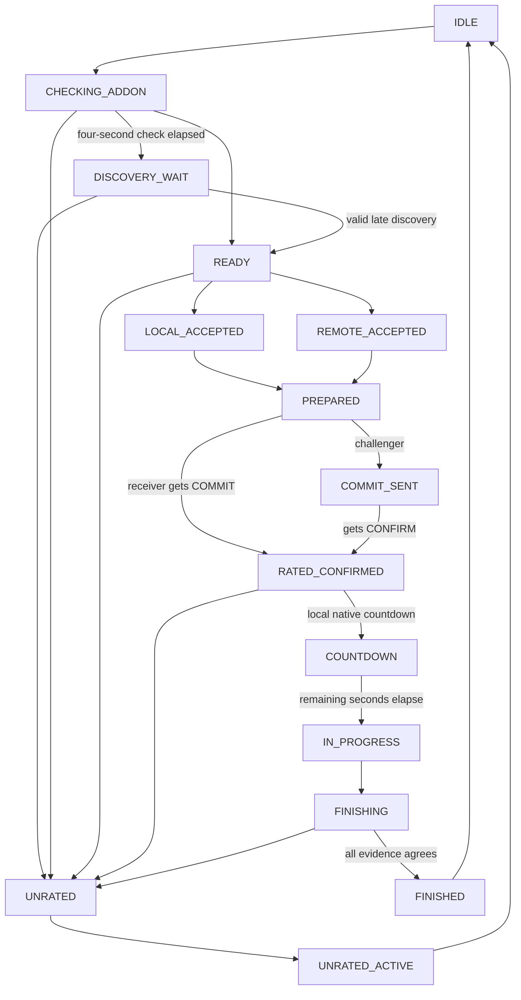

# ForeverDuelersGuild architecture

This document describes version 0.4.5: current-request nonce binding, bounded discovery retries, and retained outgoing-request diagnostics, alongside incoming identity recovery and the existing discovery/rating features. Schema and duel protocol remain version 2. After three successful 0.4.4 duels, the user reported a fourth request with the addon dialog only on the receiver, followed by another successful duel. The intermittent issue remains OPEN pending live retesting; failed-attempt status was unavailable. The earlier duel/reload flow, overview, and 0.4.3 directory discovery retain their user-confirmed evidence. [API_VERIFICATION.md](docs/API_VERIFICATION.md) separates source evidence from client tests.

## Boundaries

Each Lua file receives the shared private addon namespace through `local _, FD = ...`. The only intended externally visible persistent global is the declared per-character `ForeverDuelDB`; the slash-command registration and named dialog use WoW's standard UI facilities. There is no network service or third-party addon library.

| File | Responsibility |
| --- | --- |
| `ForeverDuel.toc` | Interface/version metadata, per-character SavedVariable, dependency order. |
| `Constants.lua` | Product/schema/protocol versions, Elo settings, tunable timeouts, queue limits, copying helper. |
| `Core.lua` | Initialization, event dispatch, slash commands, error recovery, reset confirmation. |
| `Wow.lua` | Native API adapter: readable identity, outgoing attempt/acknowledgment, incoming resolution, system messages, timers, native actions. |
| `Duel.lua` | Explicit state machine, consent, frozen snapshots, evidence collection, finalization. Dependencies are injected through an environment for tests. |
| `Comms.lua` | Registered addon prefix, bounded paced whisper queue, sender/channel checks, current-session queue invalidation. |
| `Protocol.lua` | Strict versioned ASCII envelope, validation, nonce construction, deterministic match IDs. |
| `Results.lua` | Pure localized format parsing and participant matching; no game globals. |
| `Rating.lua` | Native-level bracket/eligibility rules and deterministic level-weighted integer Elo transfer. |
| `Database.lua` | Schema-2 rating pools, validated schema-1 archive migration, SavedVariables, nonce counter, duplicate-safe commits, reset. |
| `History.lua` | Per-mode copied history/page/detail/series queries, derived statistics, and labeled opponent-rating calculation. |
| `UI.lua` | Addon-owned request/consent frame, deferred native popup suppression/restoration, chat summary/history. |
| `Profile.lua` | Read-only movable overview, pool selectors, bounded rating chart, paged history/details, isolated presentation errors. |
| `Presence.lua` | Advisory profile whispers, optional area route, bounded peer cache, map filtering, and native challenge requests. |
| `Roster.lua` | Dedicated channel-member directory, asynchronous loading, bounded refresh, and native selection restoration. |
| `Zone.lua` | Movable, paged Players in zone browser with dropdown filters and explicit native Duel button; isolated UI errors. |
| `Tooltip.lua` | Cache-only player rating lines, visible-name/GUID checks, per-build deduplication, isolated errors. |
| `Minimap.lua` | Addon-owned round-minimap shortcut, tooltip, drag positioning saved as `settings.minimapAngle`, isolated presentation errors. |
| `Media/Icon.tga` | Original crossed-swords texture used by the manifest and minimap button. |
| `Debug.lua` | Consistent prefix and optional diagnostic logging. |

## Establishing the actual duel

`DUEL_REQUESTED(playerName)` does not identify a GUID. `Wow:ResolveIncoming` compares the supplied name/full name with identities resolved from `target`, `mouseover`, `focus`, party/raid units, and nameplates. Multiple distinct matching GUIDs stop rated recovery for that request; an unavailable identity can be retried. Both cases leave native UI available. GUID and class come from local unit APIs, not from a random whisper.

An initially unresolved request retains its readable native name and original timestamp, displays a target-the-challenger hint, and retries local identity resolution every 0.5 seconds. Each retry requires the same pending object, no combat, age below 50 seconds, and a readable truthy `StaticPopup_Visible("DUEL_REQUESTED")` result. Missing popup support stops recovery and preserves ordinary play. Resolution starts negotiation with the original timestamp, so waiting cannot extend the pending deadline. Acceptance, decline/cancellation, countdown, completion, replacement, world exit/logout, combat, and adapter errors clear pending recovery. Neither directory profiles nor peer packets replace native identity evidence. Debug toggling controls diagnostic output only; `/duelrating status` includes the incoming recovery state even when logging is disabled.

The challenger uses a secure post-hook of the native `StartDuel` function to capture the requested unit's identity. That creates only a short-lived candidate. `Wow:DuelNotice` recognizes the exact native localized `ERR_DUEL_REQUESTED` text from `CHAT_MSG_SYSTEM`, `UI_INFO_MESSAGE`, or `UI_ERROR_MESSAGE`; it must arrive within the four-second presence timeout before the outgoing state begins. `Core.lua` registers both UI events and passes their message argument through `Wow:InfoMessage`. The same notice helper recognizes only the localized cancellation message besides the request acknowledgment. UI notices cannot supply countdown/result evidence.

Messages cannot create a session without the captured local native context. Overlapping outgoing attempts invalidate the candidate, and a late acknowledgment cannot revive an expired candidate. The request notification lacks an opponent field; this correlation is a constrained integration assumption, not a general server-side opponent query. Debug output records capture, recognized acknowledgment source, and expiry without acknowledgment.

Identity objects retain `guid`, `name`, `realm`, `fullName`, `className`, and `classFile`, with optional specialization metadata. When `RegionalUniqueNamesEnabled()` is true, Forever's `UnitNameUnmodified` returns name/surname and `NameUtil.GetUnmodifiedUnitFullName` supplies the native full name. Both `name` and `fullName` store that full name, `nameFormat` is `"surname"`, and `realm` comes from `GetNormalizedRealmName()` rather than the surname. Missing required native naming helpers reject the identity. With regional unique names disabled or unsupported, Retail `name-realm` handling remains.

The native full name supplies both the whisper target and exact expected sender. Locally observed `requestName`/`requestFullName` aliases may resolve the native incoming request only; they never qualify an addon sender or a winner message. Changing delimiters in arbitrary peer text is not identity proof. GUID/class still come from local unit resolution, and an ambiguous request name remains unrated.

The local specialization comes from `C_SpecializationInfo`; a received specialization is marked `peer-self-report`. Unknown specialization is transmitted as zero. Restricted client values are rejected before string operations or logging. Version 0.1.3 addressed a live trace where the previous target had a hyphen between name/surname but the received sender had a space; the corrected happy path subsequently succeeded live. Other identity/transport combinations still require testing.

## State machine

`IDLE` is represented by no active match. `CANCELLED` is a logged terminal outcome before returning to `IDLE`, rather than a resumable active object.



Negotiating/active rated states also permit fail-safe transition to `UNRATED`. Cancellation, zoning, logout, replacement, and expiry can discard the active object. Timers capture that object and check identity before acting, preventing callbacks for a previous duel from mutating a rematch.

`DISCOVERY_WAIT` is a pending discovery state, not consent or an explicit unrated choice. After four seconds the incoming dialog keeps its normal accept/decline buttons and disables rated acceptance; the outgoing discovery dialog stays hidden. A valid nonce-echoing acknowledgment may reach `READY` only for the same pending request before its 50-second limit. `UNRATED`, observed native acceptance/start, cancellation, replacement, and expiry cannot be revived by late discovery. The four-second deadline for corroborating a captured outgoing native attempt is unchanged; an addon packet cannot establish that native context.

`READY` proves compatible discovery for this nonce pair. `LOCAL_ACCEPTED` and `REMOTE_ACCEPTED` distinguish the first consenting party. `PREPARED` requires both consent actions. The initiator coordinates the acknowledgment chain regardless of who first proposed rated status:

1. Both exchange `HELLO` and nonce-echoing `HELLO_ACK`. An unbound `HELLO` is answered but cannot bind the peer nonce, profile, or match ID; this requires a valid `HELLO_ACK` echoing the current local nonce. On the first valid acknowledgment that transitions `CHECKING_ADDON` or `DISCOVERY_WAIT` to `READY`, the client sends one `HELLO_ACK` back so the peer also receives proof of its nonce.
2. Each explicit rated click sends `ACCEPT`; either player can click first.
3. The challenger in `PREPARED` sends `COMMIT` and enters `COMMIT_SENT`.
4. The receiver in `PREPARED` accepts `COMMIT`, enters `RATED_CONFIRMED`, and sends `CONFIRM`.
5. The challenger accepts `CONFIRM`, enters `RATED_CONFIRMED`, and sends `START_OK`.
6. The receiver accepts `START_OK` once and attempts `AcceptDuel()`.

Receiving one proposal or pressing one rated button cannot trigger native acceptance. The handshake establishes local evidence under cooperative clients; it is not cryptographic proof or consensus over a reliable channel.

The reciprocal acknowledgment introduced in 0.1.2 remains: if one side's early `HELLO` attempts arrive before the other session exists, one later delivered `HELLO` can still complete mutual nonce proof. Duplicate acknowledgments do not trigger reciprocal acknowledgment loops. In `LOCAL_ACCEPTED` or `PREPARED`, version 0.4.5 can answer current-peer discovery retries by repeating the existing explicit `ACCEPT`, so a receiver's early consent can reach a challenger that finishes discovery later. This never creates consent or extends its deadline. Sender/GUID/role/profile/nonce and native snapshot checks still apply. Both clients must support protocol 2 (0.4.0 through 0.4.5); version-1 packets cannot establish compatible discovery.

A secure post-hook of `AcceptDuel` immediately invalidates pending rated negotiation when another native/addon path accepts it. This prevents late handshake packets from converting an already accepted ordinary request. The addon's own agreed acceptance is identified by the incoming `RATED_CONFIRMED` state and its acceptance guard; no Blizzard callback is replaced.

## Protocol

Transport is `C_ChatInfo.SendAddonMessage` on `WHISPER`, with prefix `ForeverDuel2`. Prefix registration/send results are compared with Retail enum values, not treated as booleans. The queue allows 24 entries and spaces sends by 0.15 seconds. It drops obsolete queued consent for cancelled/replaced sessions. Valid cancellation and already-committed result packets may drain after a session ends. Discovery sends an initial `HELLO`, retries after one second, then every two seconds only while the same object remains in `CHECKING_ADDON` or `DISCOVERY_WAIT` and before its original 50-second deadline. Ordinary acceptance/start, cancellation, replacement, and expiry stop retries. A cached immutable `RESULT` is retried twice, one and two seconds after its first report, while finishing or after successful local finalization. This recovers isolated packet drops without needing the completed active state. The remaining protocol is timeout-based and has no general acknowledgment/retransmission queue.

The complete envelope contains **15 fields**, including the version marker:

```text
FD2|kind|nonce|echo|guid|peerGUID|role|rating|specId|classFile|wins|losses|verdict|level|maxLevel
```

| Field | Contract |
| --- | --- |
| `FD2` | Exact wire version. Other versions are ignored. |
| `kind` | `HELLO`, `HELLO_ACK`, `ACCEPT`, `COMMIT`, `CONFIRM`, `START_OK`, `START`, `RESULT`, `CANCEL`. |
| `nonce` | Sender's session nonce: up to 48 lowercase hexadecimal/dot/hyphen characters, with a hexadecimal digit. |
| `echo` | `-` for `HELLO`; otherwise the receiver's known session nonce. |
| `guid`, `peerGUID` | Distinct `Player-hex-hex` identifiers, at most 64 bytes each. |
| `role` | `INCOMING` or `OUTGOING`, opposite the receiver's local role. |
| `rating` | Current mode's canonical signed decimal integer in `[-100000, 100000]`. |
| `specId` | Integer `0..100000`; zero means unknown. |
| `classFile` | A recognized Retail class token. |
| `wins`, `losses` | Current mode's integers `0..1000000000`. |
| `verdict` | `-` except for `RESULT`, which contains a participant GUID. |
| `level`, `maxLevel` | Canonical integers with `1 <= level <= maxLevel <= 255`; mode is derived from equality with the cap. |

The payload is printable ASCII and at most 255 bytes. Field count, integer encoding, version, lengths, identifiers, and message-specific fields are strictly validated. The full profile appears on every message. The lifecycle then checks normalized sender, both locally resolved GUIDs, opposite role, nonce pair, expected state, and equality with the original peer profile, including levels. Advertised levels must agree with the native opponent snapshot; peer messages cannot substitute a guessed native level. An otherwise well-formed packet is not permission to change state.

`/duelrating status` reports addon version, local prefix-registration availability, any captured outgoing candidate awaiting native acknowledgment, retained timestamped outgoing-request diagnostics, the last actual transport send/result, and the last readable prefix/channel-matching packet received. Confirmed native cancellation/finish and world lifecycle clear outgoing capture/quarantine state while retaining diagnostics. Local accept/cancel hooks and adapter errors discard the captured candidate but retain its original acknowledgment ambiguity window, so a delayed unqualified native notice cannot confirm a rapid replacement request. Native countdown and combat also invalidate pending outgoing capture. The four-second native acknowledgment guard remains required. Receive diagnostics are recorded before active-session/sender validation, allowing a packet that arrived before session creation to be seen. They are observations, not proof that the packet passed lifecycle validation. A successful send result remains local submission rather than remote delivery.

## Zone presence and player tooltips

Presence uses the separate prefix `ForeverDuelZone2` for discovery whispers and optional local broadcasts where supported. The compact envelopes are:

```text
FDP2:guid:rating:mapID:classFile:level:maxLevel
FDP2|guid|rating|mapID|classFile|level|maxLevel
FDQ2|guid|rating|mapID|classFile|level|maxLevel
```

The colon-delimited profile uses bounded ASCII fields for local chat transport and is accepted over `YELL`, `SAY`, or the historically reported `UNKNOWN` distribution. The pipe-delimited envelopes retain whisper compatibility. `FDP2` is a profile; `FDQ2` is the same profile requesting a reply, accepted only over `WHISPER`. A valid query is cached and schedules a paced `FDP2` whisper reply; profiles never cause replies. The native sender argument supplies the full character name. Prefix, allowed distribution/envelope combination, payload shape, GUID, rating, map ID, Classic class, and bounded level/cap are checked before caching. Legacy `CHANNEL` profiles remain receive-only and require the current local channel number (event argument 7). `bracket` is derived from validated levels. The sender's GUID/rating/map/class/levels remain advisory self-reports. This stream never creates a rated session, grants consent, supplies a frozen match snapshot, or changes rating/history.

Presence requires addon-message APIs and timers. The first `YELL` result equal to `Enum.SendAddonMessageResult.InvalidChatType` disables that route for the session, including later world/map/rating events. This is the observed Forever result 4. Other clients may retain the existing optional 15-second heartbeat with a five-second minimum attempt interval. Receipt never schedules a broadcast. No ordinary `SendChatMessage` is used.

`Roster.lua` joins the dedicated `ForeverDuel` channel solely as a native member directory, retrying unavailable membership no more than every 30 seconds. It maps the local channel ID to its display index with `GetChannelDisplayInfo`; these are different identifiers. With the native channel UI hidden and a restorable current selection, it selects that row and reads `C_ChatInfo.GetChannelRosterInfo(displayIndex, memberIndex)` asynchronously. Channel count/roster events supply fresh counts, including when the display count remains nil or zero. A one-second poll has a five-second deadline; refresh requests are at least 30 seconds apart. Previous channel identity is resolved again before restoring its row. Opening the native channel UI or changing the selection gives control to the user. Missing APIs or unrestorable selection defer background requests; cached members and unit whispers remain usable.

Only members of this dedicated channel are read, with at most 300 rows per pass. Valid native names and player GUIDs supply candidates for the existing whisper queue; membership alone does not create a profile. Self/malformed/restricted identities are skipped. Join events can supply candidates immediately. Error boundaries isolate roster work from the whisper scan and rated-duel recovery. World exit clears pending directory work, and stale timer callbacks cannot start another request.

Whisper discovery scans readable player identities from target, focus, party1–4, raid1–40, and nameplate1–40 on relevant unit/group events and the five-second pulse. It does not scan mouseover or enumerate arbitrary nearby characters. Seeing a unit only schedules an `FDQ2` query; a received valid profile is required for a listing. Queries are paced per recipient at 45 seconds, replies at five seconds, with one queued discovery whisper sent per second. The queue holds at most 300 recipients, expires work after 120 seconds, retries failed sends after at least five seconds, and clears on world exit. Replies do not create a response loop. This queue is separate from rated-duel transport.

The own profile reads the rating selected by its current native level bracket. Unknown or restricted level/cap prevents publication. Local successful submission does not establish remote delivery. Install 0.4.5 on both clients to include current request recovery and automatic directory discovery, introduced in 0.4.3; 0.4.1/0.4.2 peers can still exchange discovery whispers. Version 0.4.0 does not answer `FDQ2`, though its rated protocol remains compatible. On Forever, changed remote ratings are refreshed by the next paced whisper query.

The ephemeral cache is capped at 300 remote profiles, expires records after 120 seconds without a fresh announcement, and returns copies to callers. It is not persisted. `GetPlayers` filters by the player's current `C_Map.GetBestMapForUnit("player")` map ID; missing map data yields no zone list. Reload starts discovery afresh. Directory/whisper reachability across realms/factions remains unverified live, and equal map IDs prove neither proximity, shared phase, nor completeness. No shared guild is required.

`Zone.lua` displays eight names, levels, modes, and ratings per page and opens from the overview or `/duelrating zone`. Name search uses case-insensitive literal substring matching. Class, rating window, sorting, and rated eligibility use addon-owned dropdown menus with direct selection. The class menu contains All plus the nine Classic classes; Death Knight, Monk, Demon Hunter, and Evoker are excluded from discovery profiles and the filter. Rating windows are All, ±100, ±200, or ±400. Sorts are name, highest rating grouped by mode/cap, or closest to the local mode rating. Windows and rating distance never compare leveling with max level or different caps. The optional rated-eligible filter calls `Rating:Eligible` on advisory profiles. Selection closes the menu and resets the page; outside clicks dismiss it without activating underlying duel buttons. Refreshes clamp pagination, and empty filtered results explain how to reset.

The Duel button revalidates the cached entry and current map, rejects combat/pending/active requests, resolves a local unit with the exact full name and GUID, and calls `StartDuel(unit, true)`. It remains available for ordinary duels outside rated level eligibility. The existing secure hook and native acknowledgment still establish the duel context; fresh native eligibility and both explicit rated choices remain necessary.

`Tooltip.lua` uses the native unit-tooltip post-callback, confirms a readable player unit and matching GUID/full name/level/cap, then reads the fresh cache or the player's own current mode rating. It sends nothing on hover. A weak-key table plus `OnTooltipCleared` limits insertion to one **Duel Rating (mode, level)** line per native build. Forbidden/restricted identities, stale level announcements, inconsistent modes, and missing records produce no line. Presence/browser/tooltip errors are isolated from `Core:Safe`, preserving ongoing duels.

`/duelrating status` includes discovery availability/status, `Zone roster` loading/restoration diagnostics, last area attempt, last discovery whisper (`lastWhisperSend`), and last receive alongside duel diagnostics. Sends identify the route/recipient and submission or retry status; receives identify the sender, distribution, and reported map. A stopped invalid area route is expected on Forever; successful directory discovery receives profiles over `WHISPER`. Targeting remains a fallback. See [MANUAL_TESTING.md](MANUAL_TESTING.md) for paired delivery and UI checks.

## Match identity and snapshots

Each side generates its own nonce from the hexadecimal server epoch, persisted monotonic counter, and random value. The counter survives reset. This provides practical collision resistance, not secrecy or authentication.

Both sides sort the GUIDs while retaining each GUID's own nonce:

```text
FD2:<lower GUID>:<its nonce>:<higher GUID>:<its nonce>
```

The match ID is derived locally and need not occupy another wire field. Changing either nonce produces a new rematch ID. Names, timestamps, and realms alone never identify a match.

Local identity, native level/cap, rating mode, rating, and W/L record are copied at session creation; the peer's profile is copied during discovery after checking it against the native opponent snapshot. Rating, specialization, and native level freshness are rechecked at consent, acknowledgment, and countdown barriers. Later packets must preserve the peer profile, including levels. The database refuses a commit if the pre-match rating no longer equals the selected pool's current rating. Specialization or level changes invalidate pending rated snapshots. Core refreshes the current runtime bracket after relevant world/level events.

## Native start and result evidence

There is no invented `DUEL_STARTED` or `DUEL_COUNTDOWN` event. Only the `CHAT_MSG_SYSTEM` adapter passes messages to `Results:Countdown` and `Results:Parse`; the new UI-event handlers do not. `Results:Countdown` parses the runtime localized `DUEL_COUNTDOWN` string format against a readable native system message. A countdown observed outside `RATED_CONFIRMED` makes the session unrated. After a valid countdown, the addon sends `START`, waits the remaining seconds, and enters `IN_PROGRESS`. `startedAt` is an inferred server-clock timestamp, not an official duel-start timestamp.

`DUEL_FINISHED` contributes only finish evidence. `Results:Parse` accepts the runtime `DUEL_WINNER_KNOCKOUT` and `DUEL_WINNER_RETREAT` formats, escapes Lua pattern punctuation, honors positional arguments, and resolves both names to the snapshotted participants. Argument 1 is the winner even when a translation displays the loser first. Full names or distinct short names are accepted. Only recognized color/player-link wrappers with matching destination and label are unwrapped; arbitrary links and unrelated duel messages are rejected.

Native finish and local winner messages may arrive in either order. The local result is sent only after both exist. Peer `START`/`RESULT` evidence can be retained during finishing, subject to the same session/profile validation. Finalization requires all of:

- A rated-confirmed local countdown before the inferred start.
- A locally reached start and a native finish event.
- The peer's session-bound `START` evidence.
- An unambiguous local native winner and the same peer-reported winner.
- An unfinalized match and a database commit valid for the current rating.

Contradictory or missing evidence cannot create a local rated record. Missing result evidence expires after eight seconds. Korean grammar selectors, Russian declensions, secret chat values, or unavailable native message routing can prevent completion and must not be guessed around.

## Rating and persistence

`Rating:Bracket(level, maxLevel)` returns `LEVELING` below the cap or `MAX_LEVEL` at the cap; unavailable, fractional, restricted, or out-of-range native values cannot establish rated eligibility. `Wow:Identity` uses `UnitLevel` and feature-detected `GetMaxPlayerLevel`, preserving ordinary-duel identity when level data is unavailable. `Rating:Eligible` requires valid levels, the same level cap, the same bracket, and an absolute difference no greater than 5. At a cap of 60, 59 versus 60 is unrated even though the difference is only one.

Both pools start independently at 1500, with K=32. Expected score uses effective rating `rating + 20 * level`. The winner's expected score is `1 / (1 + 10 ^ ((effectiveLoser - effectiveWinner) / 400))`; one positive transfer is rounded with `floor(32 * (1 - expectedWinner) + 0.5)`. The winner receives that integer; the loser receives its negation. Equal ratings and levels transfer 16. At equal ratings, a winner five levels lower gains 20; a winner five levels higher gains 12. This avoids asymmetric rounding of signed deltas. There is no zero-rating floor, so transfers remain complementary. Archived schema-1 records retain the original unweighted calculation for validation and display.

`ForeverDuelDB` is per character:

```lua
{
    schemaVersion = 2,
    player = { guid = "Player-...", ratings = {
        LEVELING = { rating = 1500, wins = 0, losses = 0 },
        MAX_LEVEL = { rating = 1500, wins = 0, losses = 0 },
    } },
    matches = {},        -- Oldest first; complete rated records only.
    finalized = {},      -- [matchId] = true
    settings = { debug = false },
    nonceCounter = 0,
    legacy = nil,       -- Optional fully validated schema-1 database archive.
}
```

A finalized record contains addon/schema/protocol versions; match ID; both full identity snapshots with level/cap; `bracket`; confirmation/countdown/start/end timestamps; `startSource = "localized-countdown-plus-timer"`; winner/loser GUIDs; local `WIN`/`LOSS`; local rating before/after/delta; opponent rating before; `ratedConfirmed`; `resultSource`; and `evidence = { agreedBeforeStart = true, localResult = true, peerResult = true }`.

`Database:Commit` validates identity, versions, levels, bracket eligibility, times, evidence, result consistency, computed weighted Elo, and the selected pool's current rating. It deep-copies serializable record data before changing history, the finalized index, and only that pool's counters. No callbacks or yields occur among those writes. Duplicate IDs, including archived IDs, return without a second change. Loading verifies each pool's historical rating chain, cumulative wins/losses, and finalized index.

Migration fully validates an original schema-1 database before copying it into `legacy`. Both new pools start at 1500; old matches are never assigned fabricated historical levels. Settings and the monotonic nonce counter are copied into the schema-2 database. Subsequent loads validate the archive as well as current pools. Unsupported or damaged schemas are preserved and disabled, never silently reset. Confirmed reset clears both pools, current history, and the entire Legacy archive, retaining settings and the nonce counter.

This is an atomic sequence of in-memory Lua mutations, not a distributed or disk transaction. SavedVariables flush belongs to the client. A crash can lose a local commit; dropped final messages can leave one participant committed while the other safely declines to commit. The current implementation does not roll back or reconcile such asymmetry.

## Read-only overview

`Profile.lua` owns a separate 960×812 movable, screen-clamped frame that scales down on opening to fit the current `UIParent` dimensions without changing the player's UI scale. `Leveling` and `Max level` selectors, plus `Legacy` when an archive exists, select the displayed pool. Four statistics cards and a progression chart sit above eight alternating history rows and a persistent right-hand details panel. Gold styling and an arrow identify the selected row. `/duelrating` and `/duelrating ui` toggle it; a Close button and `UISpecialFrames` registration support dismissal. `/duelrating summary` retains the chat summary, and `/duelrating history` still prints up to 20 recent records with match IDs.

`History:Overview(bracket)` derives current rating, W/L, win percentage, total matches, best retained rating including the initial rating, and the newest consecutive win/loss streak. `History:Page(page, pageSize, bracket)` returns bounded newest-first pages with copied records. `History:Series(bracket, limit)` returns chronological rating points in finalization order, starting with the rating before the first included duel. The chart requests the latest 40 duels, bounds its line count, and pads the vertical range so a flat history remains readable. Each mode, including Legacy, has an independent series; changing the view does not select the rated matchmaking mode. `History:Details(matchId)` returns a copied match, winner/loser identities, duration, saved local rating values, and a calculated opponent rating delta/after value marked `opponentRatingSource = "calculated"`. That projection uses saved pre-match snapshots and the recorded result; it does not verify the opponent's current or committed rating.

The details panel shows both players, their stored levels and classes, rating mode, client-local date, duration, stored knockout/retreat outcome when available, and rating before/after/delta. Specialization uses the saved name or a lookup of the saved spec ID; absent metadata is not invented. Empty history has explanatory text rather than an invented win percentage. No damage, healing, spell, or timeline data is captured or reconstructed.

The overview reads schema-2 records and the retained schema-1 archive without writing rating or consent state. Reopening resets the view to its newest page. Lifecycle render callbacks and a confirmed reset refresh it only while visible. `Profile:Run()` isolates display failures: it hides the overview and reports the chat-summary fallback without invoking duel-abort recovery. The 0.2.0 window worked in the reported live test; the 0.4.0 selectors, chart, expanded layout, scaling, and long-name rendering require a new in-game visual check. The external UI simulator remains deferred at the user's request.

## Popup integration and failures

The addon creates a functional native-styled frame before suppression. For an incoming request it schedules `C_Timer.After(0, ...)`, rechecks the active request/frame/combat state, then calls `StaticPopup_Hide("DUEL_REQUESTED")`. It never changes `StaticPopupDialogs.DUEL_REQUESTED` or unregisters Blizzard handlers. An outgoing consent frame does not replace the incoming native popup.

Continue-unrated and decline remain available during discovery/negotiation, including a combat entry that invalidates rated negotiation. Native acceptance is attempted only after the agreement barrier; a reported action error invalidates rating and attempts native restoration. Failed native decline also attempts restoration. A missing countdown times out the attempted start. Core error recovery clears the active rated flow independently of potentially failing render/transport callbacks and attempts restoration. Lifecycle/transport/deferred-popup timer callbacks run through guarded recovery.

The initial pending watchdog is 50 seconds. It invalidates rated status and attempts native restoration for an unaccepted incoming request before discarding the session. If combat prevents restoration, it retains the addon-owned ordinary accept/decline buttons in `UNRATED` until native completion or user action. Restoration allows a five-second grace past this watchdog, but does not restore after observed countdown/acceptance or during combat. The 55-second local bound is not a query of native server state; actual expiry remains a live-client test requirement.

The native game's expiry, actual action protection, and event ordering remain integration constraints. `pcall` catches errors; it does not grant protected-action permissions or prove server acceptance. Deferred callbacks, combat entry, Escape handling, replacement requests, and expired requests are explicit manual-test cases.

| Constant | Default | Purpose |
| --- | --- | --- |
| `PRESENCE_TIMEOUT` | 4 s | Initial discovery check; strict outgoing native-attempt acknowledgment window. |
| `NEGOTIATION_TIMEOUT` | 12 s | Consent through native countdown. |
| `PENDING_TIMEOUT` | 50 s | Bound an unresolved pending request. |
| `START_TIMEOUT` | 8 s | Await countdown after native acceptance attempt. |
| `RESULT_TIMEOUT` | 8 s | Collect matching finish/result evidence. |
| `RESULT_RETRIES`, `RESULT_RETRY_INTERVAL` | 2, 1 s | Retry the immutable local result after one and two seconds. |
| `MATCH_TIMEOUT` | 1200 s | Bound an abandoned active session. |

These are tunable initial values, not certified values for Forever's latency or native request lifetime.

## Future verification boundary

The record supports two independent uploads with the same match ID, identities, pre-match snapshots, and winner. A separate local prototype under `web/server` validates and reconciles these reports and recomputes its own level-weighted Elo ratings; it does not use client rating totals as central balances. The website presents the ladder, duel register and optional Blizzard character enrichment; `web/README.md` describes the local preview and configuration. Blizzard enrichment uses server-side OAuth and explicit administrator mappings to actual API IDs. Verified profile data stay separate from duel identities and ratings; they do not prove ownership or duel outcomes. Forever has no verified profile namespace in this implementation, so the default makes no upstream requests or guessed Armory links. An offline exporter under `tools/export-history.py` reads SavedVariables as data without executing Lua. None of these components is loaded by the addon, and no automatic upload or in-game central-rating synchronization has been added.

Bearer tokens can bind an upload to a provisioned GUID, but token provisioning does not establish native character ownership. Two matching uploaded reports and client `evidence` booleans are community corroboration, not cryptographic or WoW-server proof. Public hosting, ownership verification, abuse detection, seasons and server-authoritative Glicko-2 remain future work.
